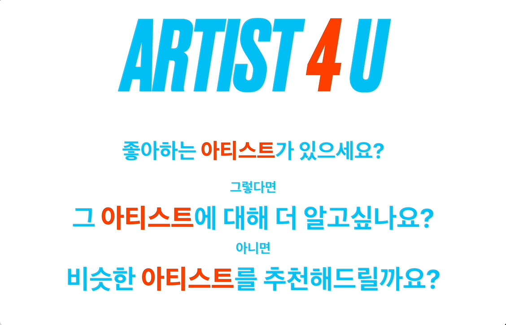
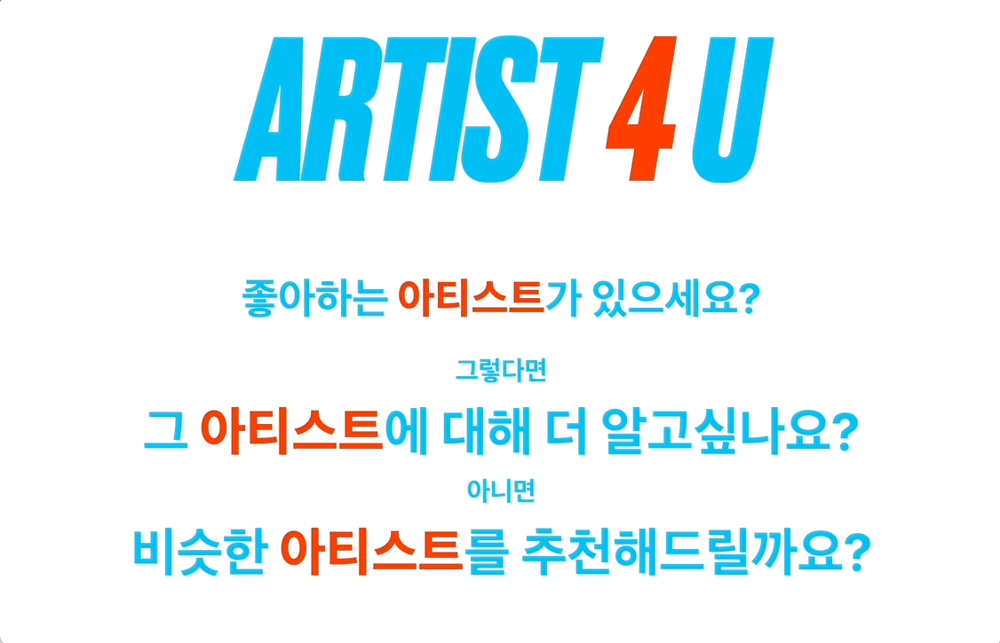

# Artist Recommendation Service
아티스트에 대해 알아보고, 비슷한 아티스트를 찾아주는 서비스.

## 1. 목표와 기능

### 1.1 목표

 - ChatGPT API를 이용한다.
 - Vanilla JS, HTML, CSS로 페이지를 구현한다.
 - JS코드를 유지보수를 위해 최대한 모듈화한다.
 - tailwindcss를 이용하여 모바일 환경 친화적인 사이트를 만든다.
 
### 1.2 기능
 
 - 좋아하는 아티스트를 입력하면 그에 관한 설명을 출력한다.
 - 좋아하는 아티스트와 유사한 아티스트를 4명 추천해준다.

## 2. 개발 환경과 배포 URL

### 2.1 개발 환경
 - HTML, Vanilla JS, CSS를 이용하였으며 Github Pages로 배포한다.

 ### 2.2 배포 URL
 

 - https://sonsugit.github.io/Artist-Recommendation-Service/index.html

 ## 3. 프로젝트 구조
 

 - 사용자가 입력한것을 받아 ChatGPT API를 이용하여 답변을 받는다.
 - 그 답변을 HTML, JS, CSS를 이용하여 알맞게 가공하여 보여준다.
 
 ## 4. UI
 ### PC
 

 #### index.html
 
 
 ```
 - 유저가 맨 처음 만나는 화면입니다.
 - 클릭가능한 글씨위에 커서를 올려놓으면 색상이 바뀌고, bounce 애니메이션이 작동한다.
 ```

 #### search.html
 
 
 ```
 - '그 아티스트에 대해 더 알고싶나요?'를 누르거나, 헤더의 '아티스트 알아보기'를 누르면 들어갈 수 있다.
 - 아티스트의 이름을 입력하면 그 사진과 아티스트에 관한 설명이 나온다.
 - 설명이나 사진을 클릭하면 스포티파이에서 그 아티스트를 검색해준다.
 ```

 #### similar.html
 
 
 ```
 - '비슷한 아티스트를 추천해드릴까요?'를 누르거나, 헤더의 '비슷한 아티스트 찾기'를 누르면 들어갈 수 있다.
 - 아티스트의 이름을 입력하면 그 아티스트와 유사하거나 관련이 있는 아티스트 4명을 추천해준다.
 - 그 아티스트들을 클릭하면 스포티파이에서 그 아티스트를 검색해준다.
 ```
 
 #### UI
 
 
 ```
 - 상단의 헤더를 누르면 similar, search 등으로 이동한다.
 - 로고를 누르면 index로 이동한다.
 - 우측 하단 GitHub Repository를 누르면 이 Repository로 연결된다.
 ```
 
 ### Mobile
 

 ```
 - PC와 대부분 동일하지만, UI적인 측면에서 가독성을 위해 몇몇 요소들의 크기가 조정된다.
 ```
 #### index.html
 
 
  ```
  - 모바일에서는 클릭 가능하다는 힌트를 주기 위해 bounce 애니메이션이 기본적으로 적용된다.
  ```

 #### search.html
 
 
 #### similar.html
 

 
 ## 5. 개발하며 느낀점
 

 - 소소하지만 처음부터 끝까지 혼자 만들어본 프로젝트였는데, 다른 사람들에게 코드 리뷰를 받는 것이 얼마나 중요한지 알게 되었습니다.
 - ChatGPT API를 사용하면서, 요청할 때마다 다른 답변을 주어서 프롬프트 엔지니어라는 직업이 왜 주목받는지 실감했습니다.
 - 기존에 실습을 하거나 단순한 한장짜리 페이지를 만들때에는 체감을 하지 못했는데, 확실히 두세장을 넘어가기 시작하니 유지보수적인 측면에서 모듈화가 정말 편하다는 것을 절실하게 느꼈습니다.
 - 모바일 환경은 커서를 움직이지 않고 사용자가 즉시 클릭을 하기 때문에 특정한 요소에 대해 UX적으로 힌트를 주는 방식이 PC와는 확연히 달랐습니다.
